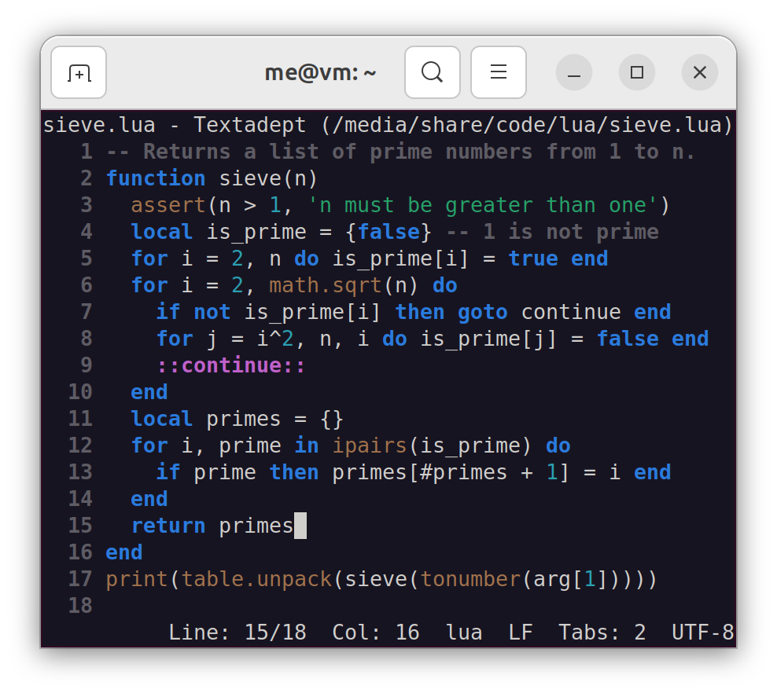

# Scinterm

Scinterm is a curses platform for [Scintilla][] that supports [ncurses][], [PDCurses][], and
X/Open Curses.

It is highly recommended to run Scinterm in a UTF-8-aware terminal with a font that supports
many UTF-8 characters ("DejaVu Sans Mono" is one of them), since Scinterm makes use of UTF-8
characters when drawing wrap symbols, some marker symbols, and call tip arrows.

[Scintilla]: https://scintilla.org
[ncurses]: https://invisible-island.net/ncurses/
[PDCurses]: https://pdcurses.org

## Requirements

* Scinterm 5.x requires Scintilla 5.4.2 - 5.x.
* Scinterm 5.0 requires Scintilla 5.3.0 - 5.4.1.
* Scinterm 4.x requires Scintilla 5.3.0 - 5.4.1.
* Scinterm 3.2 requires Scintilla 5.1.4 - 5.2.4.
* Scinterm 3.1 requires Scintilla 5.1.0 - 5.1.1.
* Scinterm 3.0 requires Scintilla 3.20.0 - 3.21.0.
* Scinterm 2.0 requires Scintilla 3.20.0 - 3.21.0.
* Scinterm 1.12 requires Scintilla 3.11.0 - 3.11.2.
* Scinterm 1.11 requires Scintilla 3.10.0 - 3.10.6.
* Scinterm 1.10 requires Scintilla 3.8.0.
* Scinterm 1.9 requires Scintilla 3.7.5 - 3.7.6.
* Scinterm 1.8 requires Scintilla 3.6.3 - 3.7.4.
* Scinterm 1.7 requires Scintilla 3.6.3 - 3.7.4.
* Scinterm 1.6 requires Scintilla 3.5.5 - 3.6.2.
* Scinterm 1.5 requires Scintilla 3.5.2 - 3.5.4.
* Scinterm 1.4 requires Scintilla 3.5.0 - 3.5.1.
* Scinterm 1.3 requires Scintilla 3.4.2 - 3.4.4.
* Scinterm 1.2 requires Scintilla 3.3.7 - 3.4.1.
* Scinterm 1.1 requires Scintilla 3.2.2 - 3.3.6.
* Scinterm 1.0 requires Scintilla 3.2.2 - 3.3.6.

## Download

Scinterm releases can be found [here][].

[here]: https://github.com/orbitalquark/scinterm/releases

## Compile

After downloading Scinterm, it is recommended to unzip it into the top-level directory of an
instance of Scintilla, similar to other Scintilla platforms like *gtk/* and *win32/*. After
that, go into the Scinterm directory and run `make patch` followed by `make` to build the usual
*../bin/scintilla.a*.

You can optionally build the demo application, jinx, by going into *jinx/* and running
`make`. Pressing the `q` key quits the demo. Note that the demo assumes [lexilla][]
is a sibling to the *../../../scintilla* directory, and that it has been built
(i.e. *../../../lexilla/bin/liblexilla.so* exists).

[lexilla]: https://www.scintilla.org/Lexilla.html

## Usage

Scinterm's Application Programming Interface [(API) documentation][] is located in the project's
*docs/* directory and covers how to create and interact with a Scintilla widget in a terminal
application.

[(API) documentation]: api.md

### Colors

If your terminal emulator supports RGB colors, you may use them freely in Scintilla messages.

If you prefer to use your terminal emulator's palette of up to 16 colors, you must use the
colors from the following table, which are listed in Scintilla's "0xBBGGRR" format.

`0x000000` | Black | `0x404040` | Light black
`0x000080` | Red | `0x0000FF` | Light red
`0x008000` | Green | `0x00FF00` | Light green
`0x800000` | Blue | `0xFF0000` | Light blue
`0x800080` | Magenta | `0xFF00FF` | Light magenta
`0x808000` | Cyan | `0xFFFF00` | Light cyan
`0xC0C0C0` | White | `0xFFFFFF` | Light white

Your terminal will map these colors to its palette for display. In some terminals, you may need
to set a style's bold attribute in order to use the light color variant.

## Curses Compatibility

Scinterm lacks some Scintilla features due to the terminal's constraints:

* Any settings with alpha values are not supported.
* Autocompletion lists cannot show images (pixmap surfaces are not supported). Instead, they
  show the first character in the string passed to [`SCI_REGISTERIMAGE`][].
* Buffered drawing is not supported.
* Caret settings like period, line style, and width are not supported (terminals use block
  carets with their own period definitions).
* Clipboard operations do not interact with the system clipboard, including X selections
  (primary and secondary).
* Code pages other than UTF-8 have not been tested and it is possible some curses implementations
  do not support them.
* Drag and drop is not supported.
* Edge lines are not displayed properly (the line is drawn over by text lines).
* Extra ascent and descent for lines is not supported.
* Fold lines cannot be drawn above or below lines.
* Fold marker highlighting consists only of bold-facing the foreground color; setting the
  selected background color has no effect.
* Hotspot underlines are not drawn on mouse hover (`surface->FillRectangle()` is not supported).
* Indent guides can only highlight in white, not the brace highlight color.
* Indicators other than `INDIC_ROUNDBOX` and `INDIC_STRAIGHTBOX` are not drawn (`surface->LineTo()`
  and `surface->FillRectangle()` are not supported for drawing indicator shapes and pixmap
  surfaces are not supported). Translucent drawing and rounded corners are not supported either.
* Some complex marker types are not drawn properly or at all (pixmap surfaces are not supported
  and `surface->LineTo()` is not supported for drawing some marker shapes).
* Mouse cursor types are not supported.
* Some styles settings like font name, font size, and italic do not display properly (terminals
  use one only font, size and variant).
* Zoom is not supported (terminal font size is fixed).
* When using the mouse in the Windows console, Shift+Double-click extends selections and
  quadruple-clicking inside a selection collapses it.

[`SCI_REGISTERIMAGE`]: https://scintilla.org/ScintillaDoc.html#SCI_REGISTERIMAGE

## Support

- [API Documentation](api.md)
- [Project page](https://github.com/orbitalquark/scinterm)
- [Issue tracker](https://github.com/orbitalquark/scinterm/issues)
- [Credits](thanks.md)

You can contact me personally at code att foicica.com.
